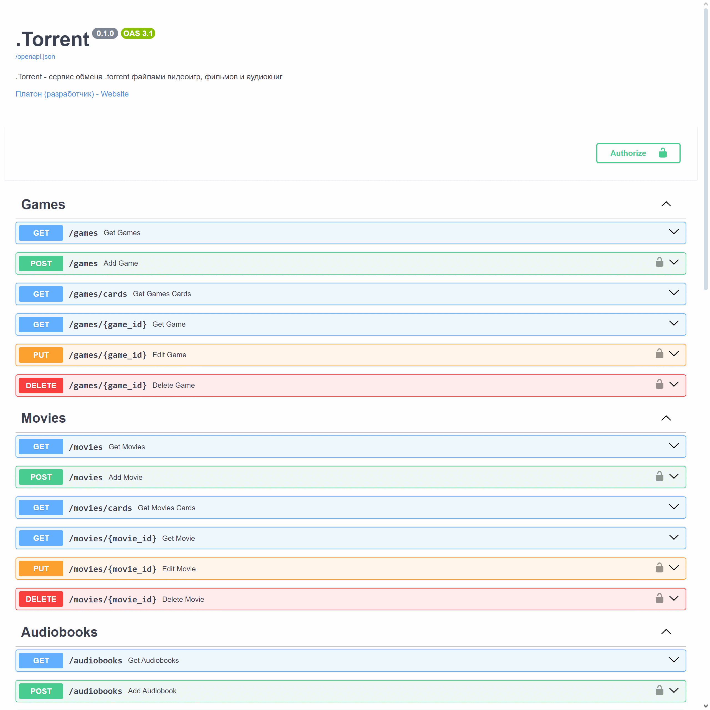
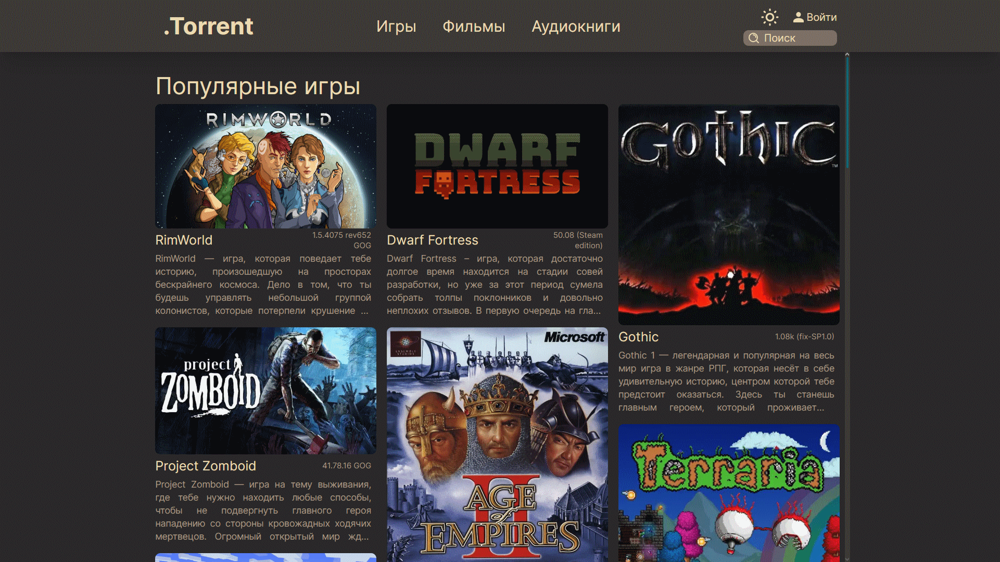
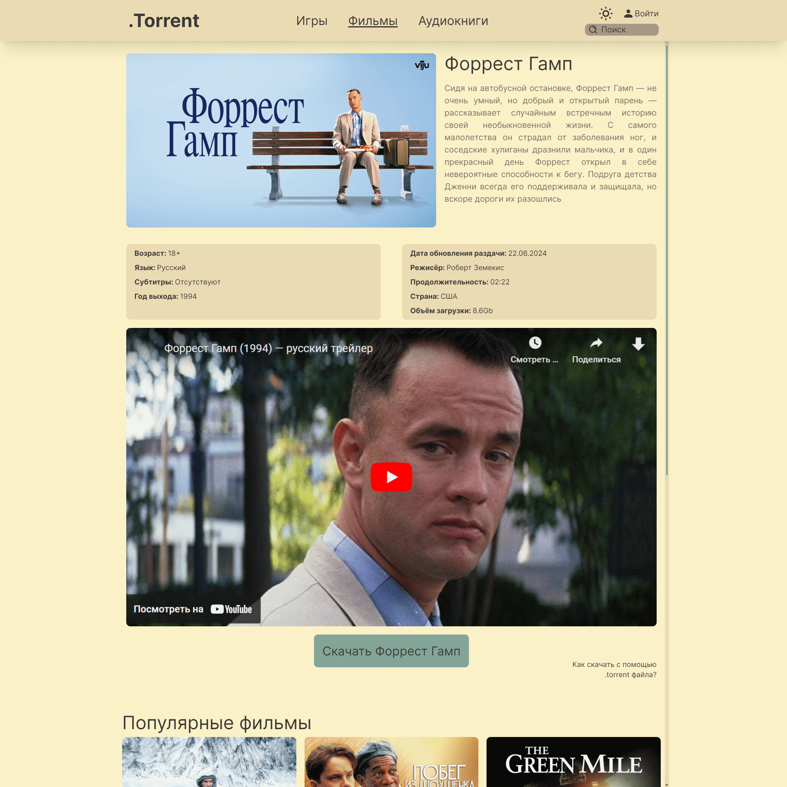

# .Torrent backend
> .Torrent - сервис обмена .torrent файлами видеоигр, фильмов и аудиокниг

## Стек
- Python 3.12
- FastAPI (REST API)
- Pydantic
- SQLAlchemy (ORM, async)
- и другие
  - Typer
  - dotenv
  - asyncio и aiofiles
  - Pillow
  - hashlib

## Возможности
- Получение, добавление, изменение и удаление трёх типов сущностей (видеоигр, фильмов и аудиокниг)
- Загрузка файлов (.torrent файлы, обложки, аудиофрагменты)
- Авторизация через JWT токен
- Вся конфигурация через файл .env (или переменные среды), для удобного запуска в Docker контейнере
- Лёгкое переключение между разными БД (в тестовом окружении используется SQLite, в контейнере PostgreSQL)
- Автодокументация с помощью Swagger

## Скриншоты

| Пример автодокументации (Swagger)|
|-|
| Пример главной страницы приложения (Frontend)|
| Пример страницы с информацией о фильме (Frontend)|

## Запуск
### Локально
    pip install -r ./requirements.txt
    ./main database create
    fastapi dev ./main.py

## ToDo
- [ ] Dockerfile
- [ ] Добавить ссылку на общий репозиторий
- [ ] Обновить requirements.txt
- [x] Теги жанров для сущностей
- [ ] Поиск